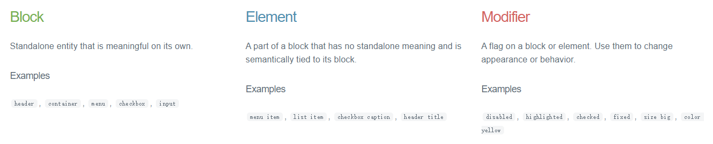
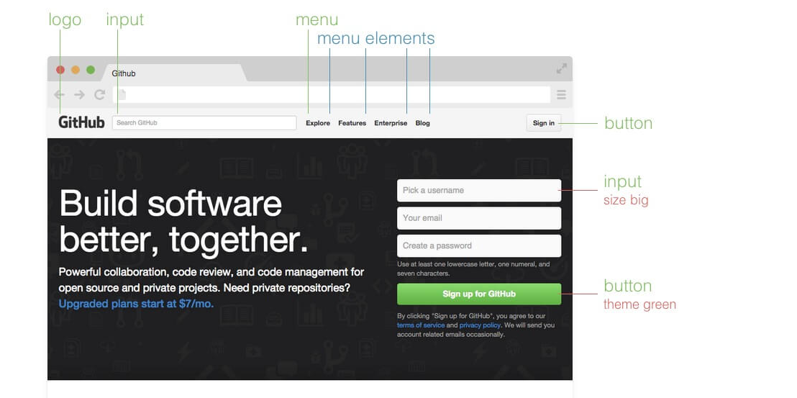
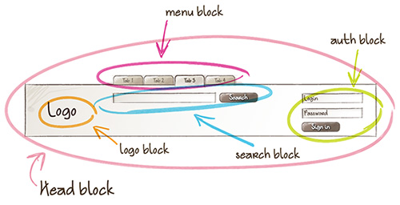
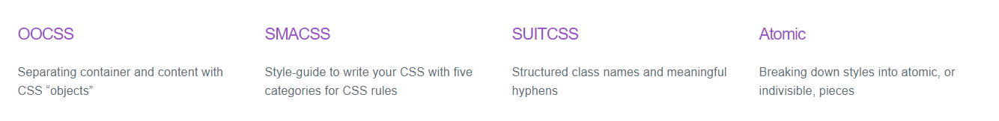

### BEM命名规范

BEM代表 **“块（block），元素（element），修饰符（modifier）”**，我们常用这三个实体开发组件。







在选择器中，由以下三种符号来表示扩展的关系：

```
-   中划线 ：仅作为连字符使用，表示某个块或者某个子元素的多单词之间的连接记号。
__  双下划线：双下划线用来连接块和块的子元素
_   单下划线：单下划线用来描述一个块或者块的子元素的一种状态

.block__element_modifier
```


#### 块（block）

一个块是设计或布局的一部分，它**有具体且唯一地意义** ，要么是语义上的，要么是视觉上的。

在大多数情况下，任何独立的页面元素（或复杂，或简单）都可以被视作一个块。它的HTML容器会有一个唯一的CSS类名，也就是这个块的名字。

针对块的CSS类名会加一些前缀（ `ui-`），这些前缀在CSS中有类似 [命名空间](https://github.com/Tencent/tmt-workflow/wiki/%E2%92%9B-%5B%E8%A7%84%E8%8C%83%5D--CSS-BEM-%E4%B9%A6%E5%86%99%E8%A7%84%E8%8C%83) 的作用。

一个块的正式（实际上是半正式的）定义有下面三个基本原则：

1. CSS中只能使用类名（不能是ID）
2. 每一个块名应该有一个命名空间（前缀）
3. 每一条CSS规则必须属于一个块


#### 元素（element）

在块中**子元素的子元素也被认为是块的直接子元素，元素的类名必须用父级块的名称作为前缀。**


#### 修饰符（modifier）

**一个“修饰符”可以理解为一个块的特定状态**，标识着它持有一个特定的属性。


###其他命名规范（CSS设计模式）




#### OOCSS

OOCSS（Object Oriented CSS），是由Nicole Sullivan提出的css理论，其主要的两个原则是：

- 分离结构和主题（**Separate structure and skin**），分离结构和主题是在于将一些视觉样式效果作为单独的“主题”来应用

- 分离容器和内容（**Separate container and content**），分离容器和内容要求使页面元素不依赖于其所处位置


#### SMACSS

SMACSS主要原则有3条：

- Categorizing CSS Rules（为css分类）
- Naming Rules（命名规则）
- Minimizing the Depth of Applicability（最小化适配深度）


##### Categorizing CSS Rules（为css分类）

Categorizing CSS Rules，是SMACSS的核心。SMACSS认为css有5个类别，分别是：

1. **Base Rules**， **基础样式**，描述的是任何场合下，页面元素的默认外观。它的定义不会用到class和ID。css reset也属于此类。
2. **Layout Rules**， **布局样式**。它和后面的Module Rules一同，描述的是页面中的各类具体元素。元素是有层次级别之分的，Layout Rules属于较高的一层，它可以作为层级较低的Module Rules元素的容器。左右分栏、栅格系统等都属于布局样式。
3. **Module Rules**， **模块样式**。它可以是一个产品列表，一个导航条。一般来说，Module Rules定义的元素放置于前面说的Layout Rules元素之内。模块是独立的，可以在各种场合重用。
4. **State Rules**， **状态样式**，描述的是任一元素在特定状态下的外观。例如，一个消息框可能有`success`和`error`两种状态，导航条中的任一项都可能有`current`状态。
5. **Theme Rules**， **主题样式**，描述了页面主题外观，一般是指颜色、背景图。Theme Rules可以修改前面4个类别的样式，且应和前面4个类别分离开来。


##### Naming Rules（命名规则）

- Layout Rules用`l-`或`layout-`这样的前缀，例如：`.l-header`、`.l-sidebar`。
- Module Rules用模块本身的命名，例如图文排列的`.media`、`.media-image`。
- State Rules用`is-`前缀，例如：`.is-active`、`.is-hidden`。
- Theme Rules如果作为单独class，用`theme-`前缀，例如`.theme-a-background`、`.theme-a-shadow`。
- Base Rules不会用到class和ID，是以标签选择符为主的样式，例如`p`、`a`，无需命名。


##### Minimizing the Depth of Applicability（最小化适配深度）

在不造成样式冲突的允许范围之内，尽可能使用短的、不限定html结构的选择符。这一点和OOCSS的分离容器和内容的原则非常相似。