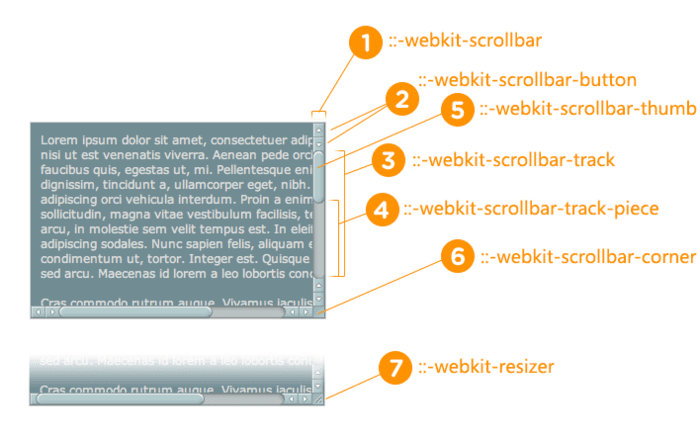

# 一、webkit滚动条样式

- **::-webkit-scrollbar** —      整个滚动条.
- **::-webkit-scrollbar-button** —      滚动条上的按钮 (上下箭头).
- **::-webkit-scrollbar-thumb** —      滚动条上的滚动滑块.
- **::-webkit-scrollbar-track** —      滚动条轨道.
- **::-webkit-scrollbar-track-piece** —      滚动条没有滑块的轨道部分.
- **::-webkit-scrollbar-corner** —      当同时有垂直滚动条和水平滚动条时交汇的部分.
- **::-webkit-resizer** —      某些元素的corner部分的部分样式(例:textarea的可拖动按钮).





``` css
/*定义滚动条高宽及背景
 高宽分别对应横竖滚动条的尺寸*/

::-webkit-scrollbar {
    width: 16px;
    height: 16px;
    background-color: #F5F5F5;
}


/*定义滚动条轨道
 内阴影+圆角*/

::-webkit-scrollbar-track {
    -webkit-box-shadow: inset 0 0 6px rgba(0, 0, 0, 0.3);
    border-radius: 10px;
    background-color: #F5F5F5;
}


/*定义滑块
 内阴影+圆角*/

::-webkit-scrollbar-thumb {
    border-radius: 10px;
    -webkit-box-shadow: inset 0 0 6px rgba(0, 0, 0, .3);
    background-color: #555;
}
```

