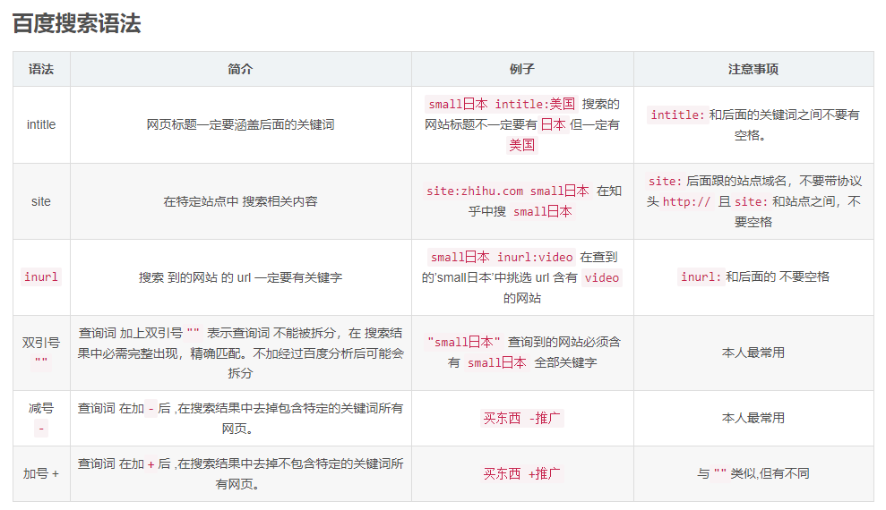
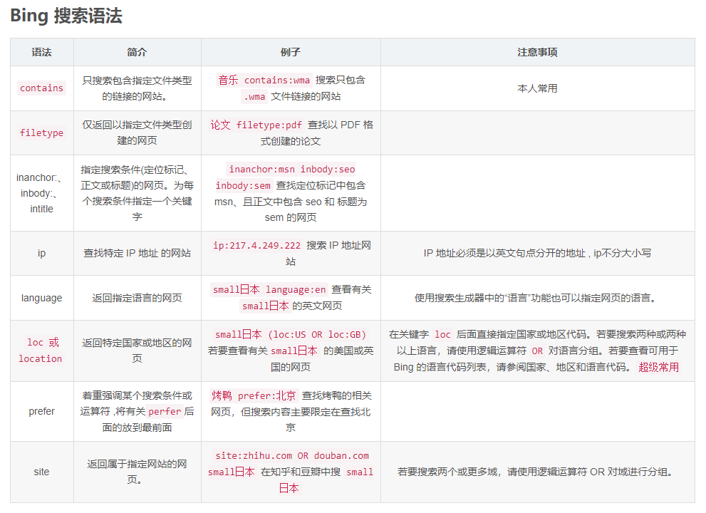

##### 百度搜索语法

<!--more-->

##### Bing搜索语法

##### Google搜索语法

1. 使用`""`进行完全匹配， **使用方法："关键字"** 
2. 使用`-`排除关键字， **使用方法：关键字 -排除关键字** ， `-`后面没有空格
3. 使用`*`进行模糊匹配 ， **使用方法：关键字 * 关键字** 
4. 使用`site`指定网站， **使用方法：关键字 site:网址** 
5. 使用`filetype`指定文件类型， **使用方法：关键字 filetype:文件类型** 
6. 使用`intitle`指定网页标题， **使用方法：关键字 intitle:关键字** 
7. 使用`intext`指定网页正文， **使用方法：关键字 intext:关键字** 