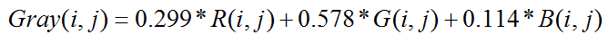

# 灰度化

在`RGB模型`中，**当R=G=B时，则彩色表示一种灰度颜色，其中R=G=B的值叫灰度值**（又称强度值、**亮度值**），灰度范围为`0-255`。获取**每个像素点的灰度值**有以下几种方式： 

#### **1. 分量法**

将图像中的**三分量的亮度**作为**三个灰度值**，可根据应用需要**选取一种灰度值**。

　　                

<br/>

#### **2. 最大值法**

将图像中的**三分量亮度的最大值**作为**灰度值**。

　　

<br/>

#### **3. 平均值法**

将图像中的**三分量亮度求平均**得到一个**灰度值**。

　　

<br/>

#### 　　**4. 加权平均法**

根据重要性及其它指标，将**三个分量以不同的权值进行加权平均**。由于**人眼对绿色的敏感最高，对红色敏感较低，对蓝色敏感最低**，因此，按下式对RGB三分量进行加权平均能得到较合理的**灰度值**。

　　

<br/>


<br/>

# 二值化

对RGB彩色图像**灰度化以后**，扫描图像的**每个像素值**，将值小于`阈值的`将像素值设为0(黑色)，将值大于等于`阈值`的像素值设为255(白色)。**`阈值`可以根据`灰度直方图`按照`特定的数学方法`获取。可参考大神[Imageshop](https://www.cnblogs.com/Imageshop/p/3307308.html)的算法。

<br/>

## 灰度直方图

**灰度图像**由**不同灰度值**的像素组成，**灰度图像中灰度值的分布是该图像的一个重要特征**。

图像的**灰度直方图**就描述了图像中灰度值分布情况，能够很直观的展示出图像中各个灰度值所占的多少。图像的灰度直方图是灰度值的函数，描述的是图像中具有该灰度值的像素的个数：其中，横坐标是灰度级，纵坐标是该灰度级出现的频率。

<br/>

# 计算阈值

#### 1、**灰度平局值值法**

- 描述

  即使用整幅图像的**灰度平均值作为二值化的阈值**，一般该方法可作为其他方法的初始猜想值。

<br/>

- 原理　　 

​      　      

<br/>

- 实现代码

```java
 public static int GetMeanThreshold(int[] HistGram) {
     int Sum = 0, Amount = 0;
     for (int Y = 0; Y < 256; Y++) {
         Amount += HistGram[Y];
         Sum += Y * HistGram[Y];
     }
     return Sum / Amount;
 }
```

<br/>

#### **2、百分比阈值（P-Tile法）** 

- 描述

  Doyle于1962年提出的P-Tile (即P分位数法)可以说是最古老的一种阈值选取方法。该方法根据**先验概率**来设定阈值，使得二值化后的目标或背景像素比例等于先验概率，该方法简单高效，但是对于先验概率难于估计的图像却无能为力。 

<br/>

- 实现代码

```javascript
/// <summary>
/// 百分比阈值
/// </summary>
/// <param name="HistGram">灰度图像的直方图</param>
/// <param name="Tile">背景在图像中所占的面积百分比</param>
/// <returns></returns>
public static int GetPTileThreshold(int[] HistGram, int Tile = 50) {
    int Y, Amount = 0, Sum = 0;
    for (Y = 0; Y < 256; Y++) Amount += HistGram[Y]; //  像素总数
    for (Y = 0; Y < 256; Y++) {
        Sum = Sum + HistGram[Y];
        if (Sum >= Amount * Tile / 100) return Y;
    }
    return -1;
}
```

<br/>

#### 3、**基于谷底最小值的阈值** 

- 描述

  此方法实用于具有明显双峰直方图的图像，其寻找双峰的谷底作为阈值，但是该方法不一定能获得阈值，对于那些具有平坦的直方图或单峰图像，该方法不合适。 

<br/>

- 实现代码

```java
public static int GetMinimumThreshold(int[] HistGram) {
    int Y, Iter = 0;
    // 基于精度问题，一定要用浮点数来处理，否则得不到正确的结果
    double[] HistGramC = new double[256]; 
    // 求均值的过程会破坏前面的数据，因此需要两份数据
    double[] HistGramCC = new double[256]; 
    for (Y = 0; Y < 256; Y++) {
        HistGramC[Y] = HistGram[Y];
        HistGramCC[Y] = HistGram[Y];
    }

    // 通过三点求均值来平滑直方图
    // 判断是否已经是双峰的图像了      
    while (IsDimodal(HistGramCC) == false) 
    {
        // 第一点
        HistGramCC[0] = (HistGramC[0] + HistGramC[0] + HistGramC[1]) / 3; 
        for (Y = 1; Y < 255; Y++)
             // 中间的点
            HistGramCC[Y] = (HistGramC[Y - 1] + HistGramC[Y] + HistGramC[Y + 1]) / 3;
        // 最后一点
        HistGramCC[255] = (HistGramC[254] + HistGramC[255] + HistGramC[255]) / 3; 
        System.Buffer.BlockCopy(HistGramCC, 0, HistGramC, 0, 256 * sizeof(double));
        Iter++;
        // 直方图无法平滑为双峰的，返回错误代码
        if (Iter >= 1000) return -1; 
    }
    // 阈值极为两峰之间的最小值 
    bool Peakfound = false;
    for (Y = 1; Y < 255; Y++) {
        if (HistGramCC[Y - 1] < HistGramCC[Y] && HistGramCC[Y + 1] < HistGramCC[Y]) Peakfound = true;
        if (Peakfound == true && HistGramCC[Y - 1] >= HistGramCC[Y] && HistGramCC[Y + 1] >= HistGramCC[Y])
            return Y - 1;
    }
    return -1;
}
```

其中IsDimodal函数为判断直方图是否是双峰的函数，代码如下： 

```java
private static bool IsDimodal(double[] HistGram) // 检测直方图是否为双峰的
{
    // 对直方图的峰进行计数，只有峰数位2才为双峰 
    int Count = 0;
    for (int Y = 1; Y < 255; Y++) {
        if (HistGram[Y - 1] < HistGram[Y] && HistGram[Y + 1] < HistGram[Y]) {
            Count++;
            if (Count > 2) return false;
        }
    }
    if (Count == 2)
        return true;
    else
        return false;
}
```

   

<br/>

 **   **

<br/>

#### 4、**基于双峰平均值的阈值** 

- 描述

  该算法和基于谷底最小值的阈值方法类似，只是最后一步不是取得双峰之间的谷底值，而是取双峰的平均值作为阈值。 

<br/>

- 参考代码 

```java
 public static int GetIntermodesThreshold(int[] HistGram) {
     int Y, Iter = 0, Index;
     // 基于精度问题，一定要用浮点数来处理，否则得不到正确的结果
     double[] HistGramC = new double[256]; 
     // 求均值的过程会破坏前面的数据，因此需要两份数据
     double[] HistGramCC = new double[256]; 
     for (Y = 0; Y < 256; Y++) {
         HistGramC[Y] = HistGram[Y];
         HistGramCC[Y] = HistGram[Y];
     }
     // 通过三点求均值来平滑直方图
     // 判断是否已经是双峰的图像了
     while (IsDimodal(HistGramCC) == false)      
     {
         // 第一点
         HistGramCC[0] = (HistGramC[0] + HistGramC[0] + HistGramC[1]) / 3;
         for (Y = 1; Y < 255; Y++)
            // 中间的点
             HistGramCC[Y] = (HistGramC[Y - 1] + HistGramC[Y] + HistGramC[Y + 1]) / 3; 
         // 最后一点
         HistGramCC[255] = (HistGramC[254] + HistGramC[255] + HistGramC[255]) / 3; 
         // 备份数据，为下一次迭代做准备
         System.Buffer.BlockCopy(HistGramCC, 0, HistGramC, 0, 256 * sizeof(double)); 
         Iter++;
         // 似乎直方图无法平滑为双峰的，返回错误代码
         if (Iter >= 10000) return -1; 
     }
     // 阈值为两峰值的平均值
     int[] Peak = new int[2];
     for (Y = 1, Index = 0; Y < 255; Y++)
         if (HistGramCC[Y - 1] < HistGramCC[Y] && HistGramCC[Y + 1] < HistGramCC[Y]) Peak[Index++] = Y - 1;
     return ((Peak[0] + Peak[1]) / 2);
 }
```

     

<br/>

#### 5、**迭代最佳阈值** 

- 描述

  该算法先假定一个阈值，然后计算在该阈值下的**前景**和**背景**的**中心值**，**当前景和背景中心值得平均值和假定的阈值相同时，则迭代中止，并以此值为阈值进行二值化**。 

<br/>

- 实现过程 

  （1）求出图象的最大灰度值和最小灰度值，分别记为gi和gu，令初始阈值为：

  ​                        

  <br/>

  ​      (2) 根据阈值T0将图象分割为**前景**和**背景**，分别求出两者的平均灰度值Ab和Af:

  　　        　　　　

  <br/>

  ​      (3) 令

  ​                          

  如果Tk=Tk+1,则取Tk为所求得的阈值，否则，转2继续迭代。

  <br/>

- 参考代码 

```java
public static int GetIterativeBestThreshold(int[] HistGram) {
    int X, Iter = 0;
    int MeanValueOne, MeanValueTwo, SumOne, SumTwo, SumIntegralOne, SumIntegralTwo;
    int MinValue, MaxValue;
    int Threshold, NewThreshold;

    for (MinValue = 0; MinValue < 256 && HistGram[MinValue] == 0; MinValue++);
    for (MaxValue = 255; MaxValue > MinValue && HistGram[MinValue] == 0; MaxValue--);
    // 图像中只有一个颜色
    if (MaxValue == MinValue) return MaxValue;
    // 图像中只有二个颜色           
    if (MinValue + 1 == MaxValue) return MinValue;

    Threshold = MinValue;
    NewThreshold = (MaxValue + MinValue) >> 1;
    // 当前后两次迭代的获得阈值相同时，结束迭代 
    while (Threshold != NewThreshold) {
        SumOne = 0;
        SumIntegralOne = 0;
        SumTwo = 0;
        SumIntegralTwo = 0;
        Threshold = NewThreshold;
        //根据阈值将图像分割成目标和背景两部分，求出两部分的平均灰度值
        for (X = MinValue; X <= Threshold; X++) {
            SumIntegralOne += HistGram[X] * X;
            SumOne += HistGram[X];
        }
        MeanValueOne = SumIntegralOne / SumOne;
        for (X = Threshold + 1; X <= MaxValue; X++) {
            SumIntegralTwo += HistGram[X] * X;
            SumTwo += HistGram[X];
        }
        MeanValueTwo = SumIntegralTwo / SumTwo;
        //求出新的阈值
        NewThreshold = (MeanValueOne + MeanValueTwo) >> 1;
        Iter++;
        if (Iter >= 1000) return -1;
    }
    return Threshold;
}
```

                   

                   

<br/>

```html
<!DOCTYPE html>
<html>

<head>
    <meta charset="utf-8">
    <title>菜鸟教程(runoob.com)</title>
</head>

<body>
    <input onchange="f(this)" type="file">
    
    <canvas id="myCanvas" width="250" height="250" style="border:1px solid #d3d3d3;">
        您的浏览器不支持 HTML5 canvas 标签。
    </canvas>
    <script>
    function f(inputBtn) {
        let url = URL.createObjectURL(inputBtn.files[0]);
        var c = document.getElementById("myCanvas");
        var ctx = c.getContext("2d");
        var img = document.getElementById("scream");
        img.onload = function() {
            ctx.drawImage(img, 0, 0, img.width, img.height);
            var imgData = ctx.getImageData(0, 0, c.width, c.height);
            let list = [];
            for (var i = 0; i < imgData.data.length; i += 4) {
                let r = imgData.data[i];
                let g = imgData.data[i + 1];
                let b = imgData.data[i + 2];
                let v = parseInt(0.299 * r + 0.578 * g + 0.114 * b);
                !list[v] && (list[v] = 0);
                list[v]++;
                imgData.data[i] = imgData.data[i + 1] = imgData.data[i + 2] = v;
                imgData.data[i + 3] = 255;
            }
            let sum = 0;
            let account = 0;
            for (let i = 0; i < 255; i++) {
                !list[i] && (list[i] = 0);
                sum += i * list[i];
                account += list[i];
            }
            let binaryV = sum / account;
            console.log(sum, account, binaryV)
            for (var i = 0; i < imgData.data.length; i += 4) {
                let v = imgData.data[i] >= binaryV ? 255 : 0;
                imgData.data[i] = imgData.data[i + 1] = imgData.data[i + 2] = v;
                imgData.data[i + 3] = 255;
            }
            ctx.putImageData(imgData, 0, 0, 0, 0, 125, 125);
            ctx.putImageData(imgData, 0, 0, 125, 125, 125, 125);
        }
        img.src = url;
    };
    </script>
</body>

</html>
```

